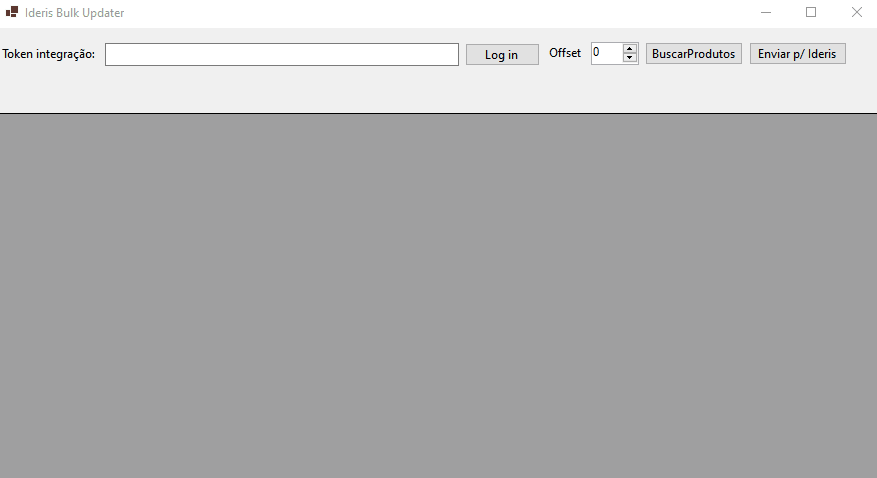

# IderisBulkUpdater
Aplicativo simples para editar em massa os produtos do Ideris, utilizando sua API.

# Como utilizar

Inserir o token de integração, fazer log in e clicar no botão "Buscar produtos".
Editar os produtos no DataGridView, selecionar as linhas que deseja atualizar no Ideris e clicar no botão"Enviar p/ Ideris".

***Não são todas as propriedades do produto que são serializadas para atualização no Ideris, ainda estou analisando o que deve ou não ser enviardo no json. No momento estou enviando apenas o marcaID/marcaIdIderis e os campos referentes as  medidas do produto e embalagem***

### Melhorias pendentes de implementação
- Melhorar a rotina de login na API.
- Implementar um cache em algum banco de dados para baixar todos os produtos e não precisar chamar a /Produto/ toda hora.
- Implementar uma fila de upload, que respeite o limite da API de 10 PUT/POST por minuto. Utilizei um await Task.Delay(6000) como teste por enquanto.
- Melhorar a UI, implementar um sistema de paging (o Model para isso já existe) e criar a opção de baixar todos os produtos ao invés de 50 em 50.
- Implementar uma lógica para serializar apenas as propriedades do produto que foram alteradas, evitando enviar dados desnecessários para a api.

##Demo rápida.

